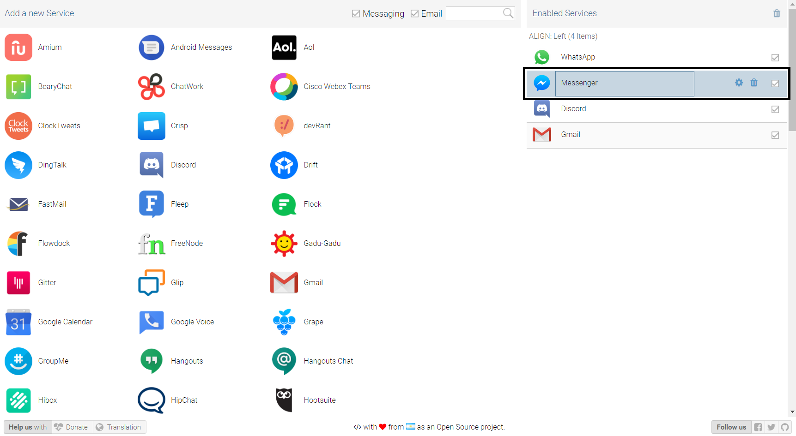
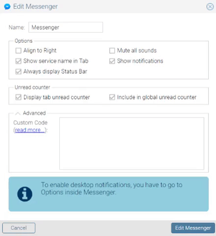

# Dark Theme for Rambox

Dark themes for Rambox services

### Applying the themes

First, find the service you wish to apply the theme to

go into the settings for that service

once you're there, click on "Advanced".

A text-box will appear, copy the JavaScript code from the darktheme.js file into it and save your changes!

That's it, all done and ready to use!

### Made in

* [JavaScript](https://en.wikipedia.org/wiki/JavaScript)
* [CSS](https://en.wikipedia.org/wiki/Cascading_Style_Sheets)
