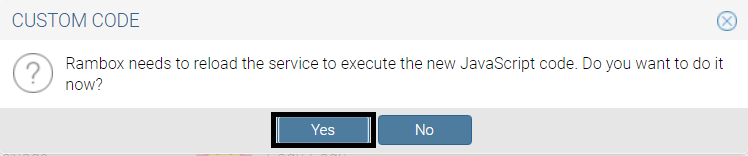

# Dark Theme for Rambox

This repository is a compilation of dark themes that I use for some Rambox services, if you would like me to add anything, let me know through an issue!
If you made a theme and would like it put here with some others, let me know by creating a PR!

### Applying the themes

First, find the service you wish to apply the theme to

go into the settings for that service

once you're there, click on "Advanced".

A text-box will appear, copy the JavaScript code from the darktheme.js file into it and save your changes!

Then press "Yes" on the service restart popup

and that's it, all done and ready to use!

### Themes

* **Messenger** - forked from [auscompgeek/fb-messenger-dark](https://github.com/auscompgeek/fb-messenger-dark).

* **Telegram** - forked from [Web Telegram Dark & Wide Screen](https://userstyles.org/styles/155933/web-telegram-dark-wide-screen)

* **WhatsApp**- forked from [vednoc/dark-whatsapp](https://https://github.com/vednoc/dark-whatsapp).

### Made in

* [CSS](https://en.wikipedia.org/wiki/Cascading_Style_Sheets)
* [JavaScript](https://en.wikipedia.org/wiki/JavaScript)